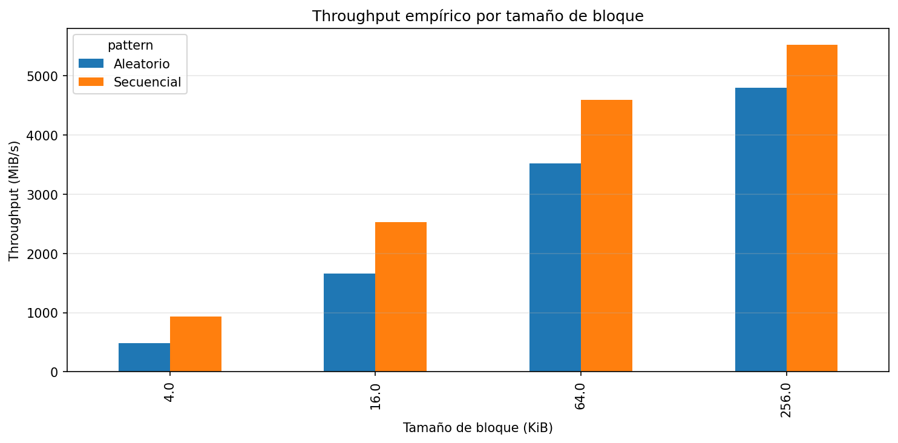
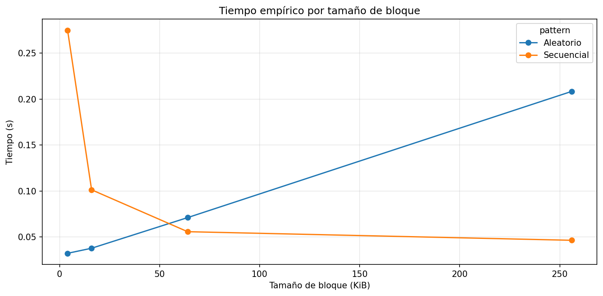
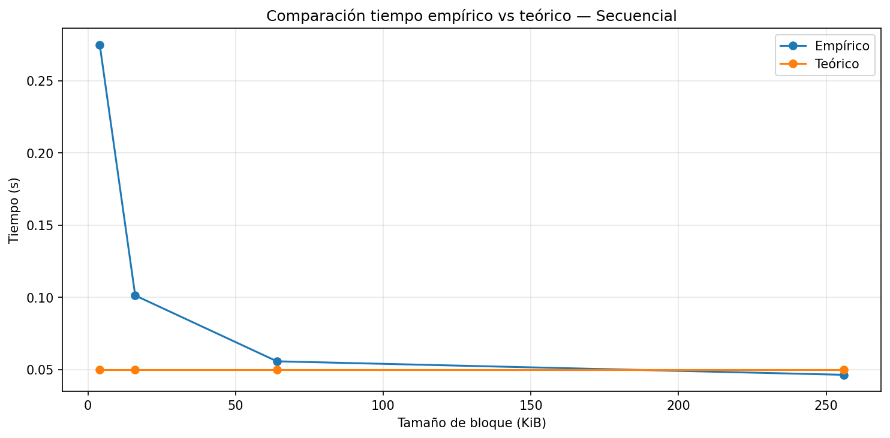
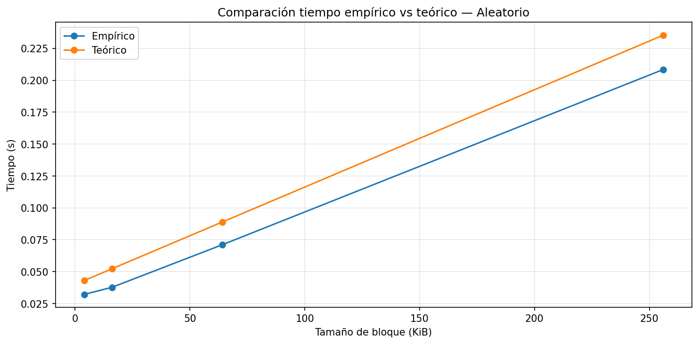
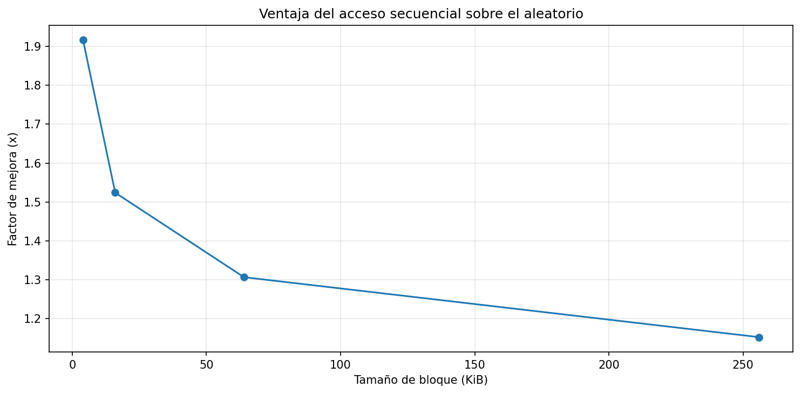

# Laboratorio — Almacenamiento en disco y desempeño de I/O

**Sistemas Operativos · Estructura de datos · 5to semestre**

---

## 1. Especificaciones del equipo

| Parámetro | Valor |
|---|---|
| Sistema Operativo | Windows 11 |
| CPU | Intel Core i5-8300H @ 2.30GHz |
| Arquitectura / Núcleos | x64 / 4 núcleos físicos |
| RAM | 20 GB DDR4 |
| Almacenamiento principal | SSD NVMe |
| Almacenamiento secundario | HDD SATA |
| CPU en reposo | 3% – 5% promedio |
| Python | 3.14.3 |
| Librerías | numpy 2.4.3 · pandas 3.0.1 · matplotlib 3.10.8 |

---

## Configuración del experimento

| Parámetro | Valor |
|---|---|
| Archivo de prueba | `io_lab_data/dataset.bin` |
| Tamaño del archivo | 256 MB (268 435 456 bytes) |
| Tamaños de bloque probados | 4 KB · 16 KB · 64 KB · 256 KB |
| Lecturas aleatorias por bloque | 4 000 |
| Semilla aleatoria | 42 |

---

### Parámetros teóricos usados (SSD NVMe)

| Parámetro | Valor |
|---|---|
| AccessLatency | 10 µs (1e-5 s) |
| ScanThroughput | 5 GB/s (~4 768 MiB/s) |

---

## 2. Resultados del experimento

### Tabla resumen

| Bloque | T. secuencial (s) | T. aleatorio (s) | TP secuencial (MiB/s) | TP aleatorio (MiB/s) | Speedup |
|---|---|---|---|---|---|
| 4 KB | 0.2748 | 0.0322 | 931.44 | 485.90 | **1.92x** |
| 16 KB | 0.1013 | 0.0377 | 2 528.26 | 1 659.24 | **1.52x** |
| 64 KB | 0.0557 | 0.0710 | 4 598.78 | 3 520.73 | **1.31x** |
| 256 KB | 0.0463 | 0.2084 | 5 528.12 | 4 799.10 | **1.15x** |

*TP = Throughput*

### Throughput empírico por tamaño de bloque

### Tiempo empírico por tamaño de bloque

---

## Teoría vs práctica

| Secuencial | Aleatorio |
|---|---|
|  |  |

### Tabla comparativa

| Patrón | Bloque | Tiempo real (s) | Tiempo teórico (s) | Ratio real/teórico |
|---|---|---|---|---|
| Secuencial | 4 KB | 0.2748 | 0.0500 | ~5.5x (real más lento) |
| Secuencial | 16 KB | 0.1013 | 0.0500 | ~2.0x |
| Secuencial | 64 KB | 0.0557 | 0.0500 | ~1.1x |
| Secuencial | 256 KB | 0.0463 | 0.0500 | ~0.9x ✓ |
| Aleatorio | 4 KB | 0.0322 | 0.0431 | ~0.75x (real más rápido) |
| Aleatorio | 256 KB | 0.2084 | ~0.230 | ~0.9x ✓ |

En secuencial con bloques pequeños el modelo subestima bastante. En aleatorio y en bloques grandes ya se ajusta bien. Más detalle en la sección de análisis.

### Speedup secuencial sobre aleatorio

---

## Análisis

### 1. Diferencial de Desempeño: ¿Cuál patrón de acceso resultó ser más eficiente en su máquina y cuál es la proporción de diferencia (ventaja secuencial)?

En mi caso se vio claramente que el acceso secuencial fue más eficiente en todos los tamaños de bloque. La mayor diferencia fue en bloques pequeños como 4 KB, donde el secuencial fue casi 1.9 veces más rápido que el aleatorio. Esto tiene sentido con lo que vimos en clase, porque en acceso secuencial básicamente se hace un solo recorrido continuo, entonces el número de accesos (M) es bajo. En cambio en el acceso aleatorio toca estar saltando por diferentes partes del archivo, entonces cada salto cuenta como un acceso nuevo y ahí es donde la latencia empieza a pesar bastante. O sea, no es que el disco sea lento, sino que la forma en que se accede hace que todo se vuelva más demorado.

---

### 2. Efecto del Tamaño de Bloque: ¿Cómo influye el tamaño de la unidad de lectura en la mitigación del costo del acceso aleatorio?

Se nota bastante que al aumentar el tamaño del bloque el rendimiento mejora, sobre todo en el acceso aleatorio. Por ejemplo cuando se pasa de 4 KB a 256 KB el throughput sube bastante. Esto pasa porque en vez de hacer muchos accesos pequeños, se hacen menos accesos pero más grandes, entonces se reduce el impacto de la latencia. Es como si en vez de hacer mil viajes pequeños, haces pocos viajes grandes, entonces el tiempo total mejora. Igual sigue siendo aleatorio, pero ya no duele tanto como con bloques pequeños. Esto conecta mucho con lo que vimos de agrupar datos para mejorar el acceso.

---

### 3. Correlación con la Teoría: ¿En qué puntos su hardware se alejó más del modelo teórico y qué factores físicos (interfaz, temperatura, caché) podrían explicarlo?

El caso donde más se aleja el modelo es en acceso secuencial con bloques pequeños. Por ejemplo en 4 KB el tiempo real fue como 0.27 s mientras que el teórico era como 0.05 s, entonces ahí hay una diferencia grande. Eso muestra que el modelo subestima el tiempo real, o sea cree que todo debería ser más rápido de lo que realmente fue. Yo creo que esto pasa porque el modelo es muy básico y no tiene en cuenta cosas reales del sistema, como la caché del sistema operativo, la interfaz del disco o incluso cómo el SSD maneja internamente las lecturas. En la teoría todo es más limpio, pero en la práctica siempre hay más cosas pasando por debajo.

---

### 4. Costo de Acceso: Explique por qué, incluso en unidades de estado sólido (SSD) sin componentes mecánicos, el acceso aleatorio sigue siendo más costoso que el secuencial.

Aunque el SSD no tiene partes mecánicas como un HDD, el acceso aleatorio sigue siendo más costoso. Esto es porque cada acceso implica cierto trabajo interno, como buscar la ubicación lógica de los datos, gestionar bloques y coordinar con el controlador. Entonces cuando se hacen muchos accesos pequeños, ese costo se repite muchas veces. En cambio en el acceso secuencial el sistema puede optimizar mejor porque los datos están seguidos y se leen de forma continua. O sea, incluso en SSD no todo es instantáneo, la forma de acceso sigue importando bastante.

---

### 5. Implicaciones en Sistemas: Si usted estuviera diseñando un Motor de Base de Datos, ¿de qué manera utilizaría estos hallazgos para optimizar la velocidad de recuperación de registros?

Si yo estuviera diseñando un motor de base de datos, trataría de organizar los datos para que el acceso sea lo más secuencial posible. Por ejemplo, almacenando registros relacionados cerca o leyendo en bloques grandes. También evitaría en lo posible hacer consultas que obliguen a ir saltando por todo el disco. Lo que muestra este laboratorio es que aunque el hardware sea rápido, como un SSD NVMe, igual la forma en que uno accede a los datos puede mejorar o empeorar mucho el rendimiento. Entonces no es solo cuestión de tener buen hardware, sino de diseñar bien cómo se usan los datos.

---

## Conclusión

En este laboratorio se vio algo que al inicio no parecía tan importante pero al final sí pesa bastante, y es cómo se accede a los datos en disco. Como vimos en clase, todo se maneja por bloques y cada acceso tiene una latencia, entonces no es lo mismo leer seguido que estar saltando entre posiciones. En mi caso el acceso secuencial llegó a ser casi 1.9 veces más rápido que el aleatorio en bloques pequeños como 4 KB, entonces ahí se nota full la diferencia.

También se entendió mejor la relación entre latencia y throughput que explicó el profe. Cuando los accesos son pequeños, el número de accesos (M) aumenta y la latencia domina el tiempo total, como en la fórmula que vimos. En cambio cuando el acceso es secuencial o con bloques grandes, se reduce M y el sistema aprovecha mejor el throughput.

El modelo teórico sí ayuda a entender la idea general, pero no es exacto. En varios casos, sobre todo en secuencial, subestimó el tiempo real, o sea pensaba que iba a ser más rápido de lo que en verdad fue. Esto seguramente es porque no tiene en cuenta cosas reales como la caché del sistema operativo, la carga del sistema y cómo funciona el SSD internamente.

En general me queda claro que en sistemas reales, como bases de datos o archivos grandes, es mejor organizar los datos para que el acceso sea lo más secuencial posible. Eso conecta con lo que vimos en clase de minimizar accesos y agrupar datos, porque al final eso reduce la latencia y mejora bastante el rendimiento.

---

## Preguntas de cierre

1. **Comparación de patrones:** Con base en sus mediciones, ¿cuántas
   veces más rápido fue el acceso secuencial respecto al aleatorio en
   su equipo? ¿Ese resultado era el esperado según la teoría?

En mi caso el acceso secuencial fue como hasta 1.9 veces más rápido que el aleatorio en bloques pequeños como 4 KB. Ese resultado sí era esperado según la teoría, porque como vimos en clase el acceso secuencial reduce la cantidad de accesos al disco y por eso la latencia afecta menos.

2. **Efecto del tamaño de bloque:** ¿Qué ocurrió con el throughput del
   acceso aleatorio a medida que aumentó el tamaño de bloque?
   ¿Por qué cree que sucede eso?

El throughput del acceso aleatorio fue aumentando a medida que el bloque crecía. Esto pasa porque se hacen menos accesos al disco, entonces aunque sigue siendo aleatorio, el impacto de la latencia disminuye un poco y mejora el rendimiento.

3. **Teoría vs práctica:** Identifique un caso en sus resultados donde
   la medición empírica se alejó del modelo teórico. ¿A qué factor
   atribuye esa diferencia?

Un caso claro es en secuencial con 4 KB, donde el tiempo real fue como 0.27 s y el teórico como 0.05 s, entonces hay bastante diferencia. Yo creo que eso pasa porque el modelo no tiene en cuenta cosas reales como la caché del sistema operativo o cómo maneja el sistema los datos.

4. **Tipo de disco:** Compare sus resultados con los valores de referencia
   de la tabla de la guía. ¿Su equipo se comportó como un HDD, un SSD
   SATA o un SSD NVMe?

Por los resultados, especialmente los valores altos de throughput que llegaron hasta más de 5000 MiB/s, se puede decir que el comportamiento es de un SSD NVMe. Es mucho más rápido que un HDD o incluso un SSD SATA, entonces coincide con el hardware que tengo.

5. **Aplicación práctica:** Imagine que debe almacenar una tabla de
   estudiantes con 1 millón de registros. Con base en lo que midió,
   ¿preferiría leerla toda de forma secuencial o acceder a registros
   individuales de forma aleatoria? ¿Por qué?

Yo preferiría leer la tabla de forma secuencial, porque como se vio en el experimento eso es mucho más eficiente que hacer accesos aleatorios. Si se accede registro por registro de forma aleatoria, se pierde mucho rendimiento por la latencia, entonces es mejor organizar los datos para leerlos de corrido.